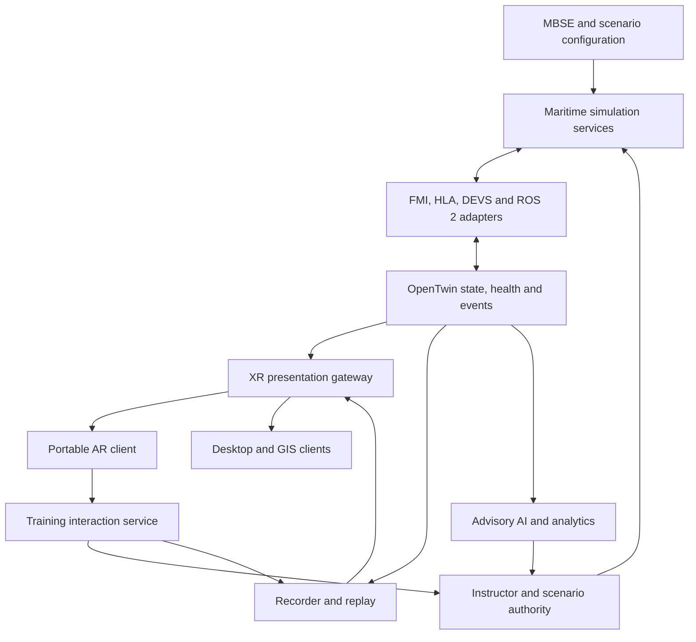
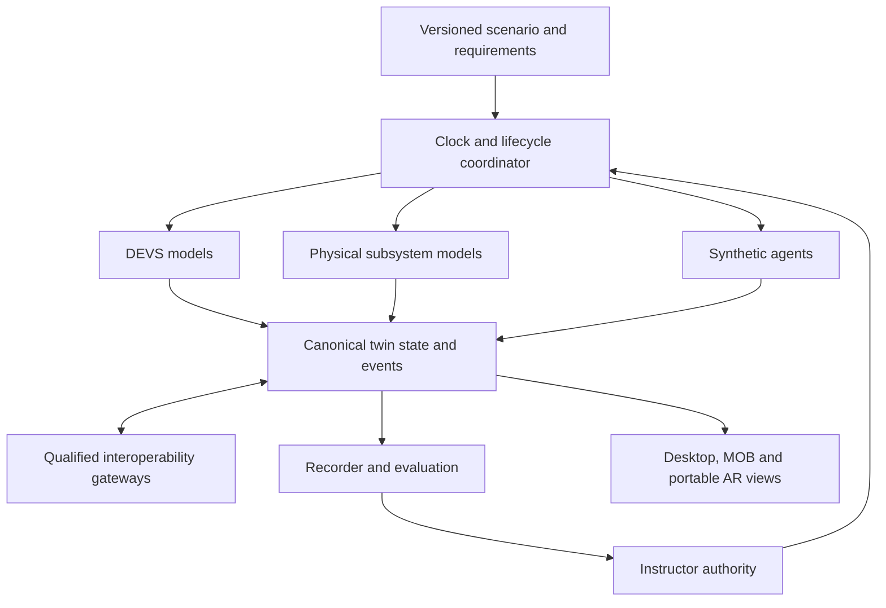

# jfxmbdss

## OpenTwin MBDSS --- Open Maritime Decision Support & Simulation

> Open-source reference architecture and technology compendium for
> MBSE-driven maritime digital twins, distributed simulation,
> interoperable C2 research, AI-assisted decision support, training,
> lifecycle engineering, and multi-domain experimentation.

**jfxmbdss** consolidates an open engineering architecture around
**MBSE, OpenTwin, Modelica/FMI, DEVS, HLA, C2SIM, OARIS, ROS 2/DDS,
multi-agent simulation, AI, synthetic environments, and modular digital
twins**.

The project is intended for research, education, engineering analysis,
training, interoperability experiments, humanitarian/logistics
scenarios, and non-operational simulation. It is not an operational
command system, weapon-control system, targeting system, or substitute
for qualified professional decision-making.

## Vision

``` text
MBSE + Open Standards + Physics Simulation
                  +
       Distributed Simulation
                  +
          OpenTwin Core
                  +
       AI / Data / Analytics
                  =
Open Maritime Digital-Twin Ecosystem
```

The architecture favors stable, technology-neutral interfaces so
vessels, ports, subsea assets, sensors, environmental models, simulation
engines, and analytical services remain replaceable.

## Objectives

-   Apply MBSE to maritime system-of-systems engineering.
-   Provide modular OpenTwin interfaces for maritime digital twins.
-   Separate model semantics from simulation implementations.
-   Support multi-fidelity physical, discrete-event, and multi-agent
    simulation.
-   Support Modelica and FMI/FMU for portable multidomain subsystem
    models.
-   Support HLA-oriented distributed simulation.
-   Support C2SIM/OARIS-oriented interoperability research where
    appropriate.
-   Integrate ROS 2/DDS for modular robotics and autonomy experiments.
-   Enable repeatable scenarios, telemetry recording, replay, and
    validation.
-   Provide AI-assisted analytics with human oversight.
-   Support lifecycle, maintenance, logistics, training, humanitarian,
    and engineering scenarios.
-   Support portable AR training clients through qualified device profiles.
-   Reuse MOB scenarios, twin identity and replay across desktop and AR clients.
-   Separate required dependencies, optional integrations, and research
    references.

## Reference Architecture

The architecture includes a proposed **portable maritime AR training profile**
inspired by IVAS at the conceptual level. It connects to the existing OpenTwin
and MOB training services through a presentation gateway. No IVAS hardware,
SDK, device access or working integration is supplied by this repository.



| Layer | Responsibility | Integration boundary |
| --- | --- | --- |
| Engineering | Requirements, configuration, model versions and scenario objectives | MBSE registry and scenario manifest |
| Simulation | Maritime assets, environment and multidomain models | Existing FMI/HLA/DEVS/ROS 2 adapters |
| Twin core | Canonical asset state, health, events and provenance | Versioned state and event schemas |
| Presentation gateway | Role-filtered scene state, annotations and status | Client API independent of simulation middleware |
| Portable AR | Local rendering, tracking, input and device health | Qualified OpenXR/runtime and device-specific capabilities |
| Training interaction | Checklist acknowledgments, annotations and assistance requests | Instructor-controlled scenario service |
| Assessment | Time-aligned recording, replay and human-reviewed feedback | Shared session/event identifiers |

The headset is a presentation and training-input endpoint. Simulation services
retain authoritative asset state; instructor services retain scenario control.
C2SIM/OARIS interfaces remain behind their existing research adapters, rather
than becoming headset command channels.


## Multi-Model and Multi-Agent Integration Architecture

This extension adds a categorized research catalog and proposed integration
boundaries to the existing maritime, MOB and portable AR architecture.
**No listed component is integrated merely by appearing in this document.**
The initial executable scope remains synthetic logistics, maintenance,
infrastructure and instructor-led training scenarios.



| Integration plane | Responsibility | Candidates |
| --- | --- | --- |
| Architecture and semantics | Requirements, entity types and model provenance | UAF, selected UDDL artifacts, canonical OpenTwin schemas |
| Continuous models | Physical subsystem behavior | Existing Modelica/FMI services; CMD reference pending identification |
| Discrete events | Scenario lifecycle, queues and event ordering | VLE, PythonPDEVS; ModelicaDEVS subject to license review |
| Agent services | Asynchronous research tasks and synthetic resource allocation | OpenMAS, reactive-planner reference, qualified multi-agent environments |
| Federation | Explicit mappings between canonical state and selected exchange models | HLA/NETN FOM, C2SIM, selected OARIS research interfaces |
| Presentation | Scene, map and training views | Existing Godot/OpenXR path; optional Delta3D or ODINv2 evaluation |
| Offline evaluation | Numerical comparison, model robustness and compute studies | adlib, ARL-HMS, Sniper where appropriate |

### Contracts and execution rules

| Contract | Required metadata and behavior |
| --- | --- |
| Model manifest | Upstream/revision, license, fidelity, runtime, interface version and validation evidence |
| Entity state | Stable ID, units, reference frame, timestamp, producer and validity |
| Event | Unique ID, simulation time, source, schema version, causal reference and acknowledgment |
| Agent observation | Scenario/model revision, allowed data scope and synthetic-data flag |
| Agent output | Typed proposed action or advisory result; authority and acceptance recorded by the scenario service |
| Timing | One simulation-clock authority, step/event policy, late-message handling and deterministic tie-breaking |
| Lifecycle | Initialize, ready, run, pause, checkpoint where supported, reset and stop |
| Replay | Seeds, model versions, inputs, events, accepted decisions and reproducibility tolerance |

An asynchronous agent runtime does not provide DEVS time semantics. A broker
such as Kafka transports messages but does not establish a simulation clock.
A DEVS/FMI bridge needs explicit solver-step, event-order and coupling rules.
Each entity has one authoritative state producer; gateways must prevent
duplicate events and feedback loops.

NETN FOM supplies information-model modules for an HLA federation, not an RTI.
C2SIM and OARIS require separate semantic mappings and profile selection.
A common acronym or transport does not prove conformance. Keep external
schemas versioned at gateway boundaries rather than embedding every standard
in the twin core.

Portable AR continues to consume role-filtered presentation state and send
training interactions. It does not become a direct interface to external
command systems. Existing MOB asset IDs, instructor authority and replay
records remain shared across clients.

### Proposed implementation sequence

1. Define canonical manifests and schemas for a synthetic MOB logistics or
   maintenance scenario.
2. Implement one discrete-event backend and recorded replay before adding
   other simulators.
3. Add a single OpenMAS research service with bounded tasks and reproducible
   observations; distinguish wall-clock completion from simulation time.
4. Compare a second model implementation using declared tolerances and
   identical inputs.
5. Add one selected federation profile with schema, ownership and clock tests.
6. Reuse the desktop/AR gateway and evaluate multi-user replay and stale data.

Acceptance evidence must include schema rejection, unit/frame conversion,
reset, out-of-order events, disconnect recovery, duplicate suppression,
repeatable replay and the limits of model fidelity. HPC and AI studies are
optional evaluation paths; neither implies validated maritime behavior.

## OpenTwin Maritime Digital Twin

OpenTwin MBDSS synchronizes physical, simulated, synthetic, and
analytical representations through a common semantic and interface
layer.

``` text
Physical / Simulated Asset
           |
 Sensors / Simulation State
           |
      Adapter Layer
           |
      Semantic Model
           |
   OpenTwin Interface Bus
           |
   State / Health / Events
           |
       Twin Core
           |
 Analytics / Simulation / Visualization
           |
       Human Review
```

A twin may represent a vessel, research submarine, autonomous surface or
underwater research platform, port, dock, logistics node, sensor
network, environmental region, training asset, or fully synthetic
entity.

## Modular Digital Twin Interfaces

### Asset

Identity, type, version, configuration, geometry reference,
capabilities, lifecycle state, model references, and health.

### State

`initialize()`, `configure()`, `update_state()`, `get_state()`,
`checkpoint()`, `restore()`, `reset()`, and `shutdown()`.

### Hydrodynamics

Replaceable CFD, reduced-order, and engineering hydrodynamic models with
geometry, boundary-condition, environment, force, moment, and flow
interfaces.

### Structural

Structural loads, deformation, fatigue-oriented research, and coupling
to other engineering domains.

### Propulsion

Technology-neutral interface for conventional, electric,
hybrid-electric, battery, fuel-cell, and conceptual research propulsion
systems.

### Electrical

Generation, distribution, storage, loads, converters, and energy
management.

### Thermal

Heat loads, cooling, temperatures, thermal networks, and subsystem
thermal state.

### Fluid Systems

Pumps, tanks, piping, hydraulic services, and other fluid-network
abstractions.

### Sensors

Canonical sensor identity, reference frame, timestamp, measurement,
uncertainty, and health metadata.

### Environment

Bathymetry, currents, waves, wind, weather, visibility, temperature,
salinity, coastline, port infrastructure, and synthetic environmental
events.

### Telemetry

``` text
asset.position.*
asset.attitude.*
asset.velocity.*
propulsion.*
energy.*
sensor.*
environment.*
mission.*
health.*
simulation.*
```

### Health

Overall and subsystem health, anomalies, confidence, and recommended
engineering inspection.

### Mission

Objectives, phases, routes, constraints, events, resources, and
evaluation criteria.

### Scenario

``` text
scenario/
├── manifest.yaml
├── assets/
├── environment/
├── missions/
├── events/
├── models/
├── scoring/
└── metadata/
```

### AI Agent

AI services may produce forecasts, anomaly scores, classifications,
simulation hypotheses, recommendations, scenario adaptations, and
training feedback. Outputs remain advisory and auditable.

### FMI / FMU

Portable multidomain subsystem boundary for electrical, propulsion,
thermal, mechanical, fluid, energy, and control models.

### HLA

``` text
Federation
├── Vessel Federate
├── Subsea Federate
├── Port Federate
├── Environment Federate
├── Sensor Federate
├── Mission Federate
├── AI Federate
├── Instructor Federate
├── Recorder Federate
└── Visualization Federate
```

### ROS 2 / DDS

Modular robotics, sensor integration, autonomy research, and
publish/subscribe middleware.

### Visualization

3D clients, dashboards, GIS, notebooks, XR training clients, replay, and
after-action analysis.

### Portable AR Session

Device capabilities, session roles, tracking validity, spatial anchors,
overlay provenance, checklist interactions and replay references. See the
portable augmented-reality profile for contracts and qualification gates.

### Model Registry

Each model should record ID, version, domain, fidelity, interface
version, provenance, license, validation status, and compatibility.

## MBSE and Architecture Engineering

``` text
Stakeholder Needs
       |
Operational Analysis
       |
System Context
       |
Capabilities
       |
Logical Architecture
       |
Interfaces
       |
Physical Architecture
       |
 CAD / Geometry + Simulation Models
       |
   OpenTwin MBDSS
       |
Verification / Analysis
```

Possible approaches include SysML-oriented workflows, UAF viewpoints,
and Arcadia/Capella. Interfaces should remain independent of a specific
modeling tool whenever practical.

## Modeling and Simulation

jfxmbdss treats simulation as a federation of replaceable models rather
than one monolithic simulator.

Domains can include hydrodynamics, structures, propulsion, electrical,
thermal, fluid networks, sensors, environment, logistics, maintenance,
human operators, multi-agent behavior, ports, and infrastructure.

``` text
Conceptual Model
      |
Reduced-Order Model
      |
Engineering Model
      |
High-Fidelity Simulation
```

Every model should declare assumptions, fidelity, validation status,
provenance, and computational cost.

## Distributed Simulation

``` text
                 Scenario Manager
                        |
          Vessel / Subsea / Port
                        |
                 HLA / Event Bus
                        |
 Environment / Sensors / AI / Recorder / Visualization
```

Federations should explicitly document time management, coordinate
systems, units, ownership, publish/subscribe contracts, event ordering,
deterministic replay, synchronization, and schema compatibility.

## Interoperability

Candidate interfaces and standards include HLA, FMI, DDS, ROS 2,
C2SIM-oriented simulation interoperability, OARIS-oriented maritime
interoperability, UAF-oriented architecture exchange, OGC geospatial
standards, REST/OpenAPI, AsyncAPI, JSON Schema, Protocol Buffers, and
MQTT where appropriate.

External standards should be isolated behind adapters rather than
embedded into the OpenTwin core.

## Multi-Agent Simulation

Multi-agent experiments can represent synthetic vessels, port services,
logistics resources, rescue assets, traffic, environmental actors,
autonomous research platforms, instructors, and simulated operators.
Policies should be reproducible, versioned, and clearly distinguished
from real operational behavior.

## AI and Decision Support

Potential research uses include anomaly detection, predictive
maintenance, resource forecasting, simulation surrogate models, scenario
classification, synthetic-data generation, trajectory analysis, model
calibration, optimization, training assessment, RAG-based engineering
knowledge, and automated reporting.

``` text
Telemetry + Simulation + Scenario + Metadata
                    |
                 Data Layer
                    |
              AI / Analytics
          Detect / Forecast / Recommend
                    |
             Explain / Validate
                    |
               Human Review
```

For consequential real-world decisions, AI output must not be treated as
automatically authoritative.

## Maritime and Subsea Simulation

The architecture can support civilian, research, training, humanitarian,
logistics, environmental, and engineering scenarios involving surface
vessels, research submarines, subsea vehicles, autonomous research
platforms, ports, docks, offshore infrastructure, logistics vessels,
environmental monitoring, disaster-response simulation,
search-and-rescue training, lifecycle analysis, and virtual
commissioning.

Use original or appropriately licensed models and avoid reproducing
restricted or proprietary platform specifications.


## Mobile Offshore Base (MOB) Training Environment

JFXMBDSS adds a non-operational naval-training and maritime-logistics profile inspired by the [Mobile offshore base (MOB) concept](https://en.wikipedia.org/wiki/Mobile_offshore_base). The reference describes a modular floating base assembled from interconnected semi-submersible platforms. In this project, the concept is represented as a research and training environment for instructors, engineers, emergency planners, and maritime logistics teams.

The MOB digital twin can represent:

- modular floating units, ballast states, joints, mooring, decks, service areas, and maintenance zones;
- runway or flight-deck operations, embarkation, transfer, loading, unloading, and port-interface scenarios;
- vessel, support craft, aircraft-support, subsea, sensor, environment, and logistics twins;
- sea state, wind, waves, currents, visibility, weather, communications, and infrastructure events;
- instructor-controlled events, trainee roles, checklists, telemetry, scoring, replay, and after-action review.

### Training Scenario Boundary

```text
Training Objectives and Requirements
                ↓
MOB Configuration and Asset Twins
                ↓
Environment / Sea State / Weather
                ↓
Vessel, Deck, Logistics and Maintenance Models
                ↓
HLA / FMI / DEVS / ROS 2-DDS Interoperability
                ↓
Instructor Console + XR / 3D Visualization
                ↓
Telemetry, Assessment, Replay and After-Action Review
```

Recommended training profiles include deck and seamanship exercises, maritime logistics, maintenance and damage-control drills, search-and-rescue coordination, humanitarian and disaster-response scenarios, environmental monitoring, and virtual commissioning of modular offshore infrastructure.

This profile is intended for education, research, preparedness, and non-operational simulation. It excludes weapon control, targeting, strike planning, and operational command functions. Model geometry, scenarios, and datasets should use original or appropriately licensed assets.


## Portable Augmented Reality — IVAS-Inspired Training Profile

**Status: proposed architecture; no implemented IVAS adapter.**

The user-provided [Integrated Visual Augmentation System reference](https://en.wikipedia.org/wiki/Integrated_Visual_Augmentation_System)
describes wearable visual augmentation combining a display, portable computing,
sensors, networking and power. jfxmbdss adopts the modular wearable concept
for maritime training, inspection rehearsal and digital-twin visualization.
This secondary reference is not an SDK specification or evidence of accessible
IVAS interfaces.

The design does not claim IVAS equivalence, certification, military-grade
ruggedness, sensor access or binary compatibility. Its scope follows the
project's existing non-operational training boundary.

### Portable system modules

| Module | Proposed responsibility | Required qualification |
| --- | --- | --- |
| Display and interaction | Asset labels, instructional overlays, checklists and annotated 3D scenes | Device/runtime profile, readable presentation and supported input methods |
| Local compute | Render loop, session cache and local tracking integration | Measured performance, temperature and power behavior |
| Pose and spatial registration | Headset pose, anchors and alignment with a vessel or training mock-up | Frame conventions, calibration revision, drift and tracking validity |
| Optional cameras | Recorded or permitted live imagery for inspection-training views | Actual device API, timestamps, calibration, consent and retention rules |
| Connectivity | Synchronize scene updates and training events with the gateway | Authenticated sessions, reconnect behavior and stale-data detection |
| Power and device health | Battery/runtime status, thermal state and disconnect events | Supported device telemetry; no assumed endurance |
| Instructor endpoint | Assign exercises, review annotations and control replay | Role-based permissions and auditable scenario changes |

Thermal, low-light, depth, hand tracking, eye tracking and passthrough are
**optional capabilities**, not mandatory features or inferred IVAS APIs.
Provide synthetic/recorded inputs for a desktop-first prototype. A headset
without qualified spatial tracking can use a fixed panel view rather than
claiming accurately registered object overlays.

### Open software and standards profile

| Component | Proposed use | Scope |
| --- | --- | --- |
| [OpenXR](https://www.khronos.org/openxr/) | Application-to-XR-runtime boundary | Open API standard; not a guarantee that every device exposes cameras, anchors or passthrough |
| Godot | Candidate open rendering and interaction client | Qualify the chosen release, graphics backend and OpenXR extensions |
| [Monado](https://monado.freedesktop.org/) | Candidate open-source XR runtime | Device, operating-system and driver support vary; inspect the supported-hardware matrix |
| Blender / glTF assets | Prepare original training scenes and geometry | Track mesh revision, units and asset licenses |
| Existing OpenTwin APIs | Deliver scene state and receive training interactions | Define versioned schemas and authorization at the gateway |
| Existing ROS 2/DDS and HLA adapters | Bridge synthetic sensor or simulation state | Remain server-side; no automatic mapping to XR semantics |
| PostgreSQL/PostGIS and recorder | Session metadata, spatial references and replay indexes | Apply existing provenance and access policies |

Khronos documents OpenXR support in Godot, but that does not establish a
working IVAS port. Monado is a candidate only for a supported, tested device
configuration. An open application can still depend on proprietary firmware,
drivers or runtimes; record those dependencies separately.

A future adapter to actual IVAS would require authorized hardware access,
documented SDK/protocols, compatible runtime support and independent tests.
Until those inputs exist, record its compatibility as **unknown**, and use
a generic AR client for the proposed implementation.

### Spatial and temporal contracts

| Contract | Minimum information |
| --- | --- |
| Session | Session/scenario IDs, participant role, device profile and schema version |
| Pose | Timestamp, parent frame, position, orientation convention and tracking status |
| Anchor | Anchor ID, vessel/deck/compartment frame, calibration revision and validity |
| Overlay | Asset ID, source kind, timestamp, confidence/quality and expiry policy |
| Interaction | Event ID, actor/session, checklist or annotation reference and acknowledgment |
| Device status | Connection, battery/thermal fields where available and last update time |
| Replay | Scenario/model revisions, original event timestamps, playback time and replay flag |

Distinguish Earth/geospatial, vessel, deck/compartment, local tracking and
headset frames. Vessel motion must not be mistaken for user motion. Validate
transform direction, handedness, units and reset/relocalization behavior
before enabling spatially registered overlays on a moving-platform scenario.

Keep the local rendering/tracking clock separate from the simulation clock.
Record acquisition, ingestion and display timestamps where available. Label
synthetic, recorded and live data visibly. Hide or mark expired overlays;
loss of tracking must disable registered overlays rather than leave them
apparently attached to the wrong object.

### Fusion with the Mobile Offshore Base profile

The portable AR client reuses MOB asset IDs, scenario packages, instructor
events and replay services. It does not maintain a competing vessel or
platform model.

| Existing MOB workflow | AR extension | Assessment evidence |
| --- | --- | --- |
| Infrastructure familiarization | Compartment labels and instructor-authored equipment information | Visited training stations and completed tasks |
| Maintenance rehearsal | Versioned inspection checklists and annotated component twins | Checklist acknowledgments, notes and source-document revision |
| Damage-control drills | Synthetic incident indicators and exercise instructions | Time-stamped participant/instructor events |
| Logistics training | Training cargo/zone annotations and workflow checklists | Exercise task completion and shared asset identity |
| Humanitarian/SAR exercises | Synthetic scene annotations and team-role instructions | Instructor-reviewed communications and activity timeline |
| Virtual commissioning | Display simulated subsystem states beside a mock-up or virtual asset | Comparison between expected and observed simulation state |

AI may retrieve engineering references and propose explanations with cited
document versions. It does not autonomously alter training authority or
replace instructor review. The scope remains training and engineering
visualization; the existing exclusions for targeting and weapon control
continue to apply.

### Connectivity, recording and human factors

Cache the approved scene and instructional content for a bounded offline
session. Mark remote state as stale after the profile's configured limit.
On reconnection, reconcile event IDs and timestamps without silently
overwriting instructor decisions. Use separate roles for instructors,
trainees and observers.

Record the minimum data needed for debriefing. Raw camera imagery, voice and
gaze data are optional and require an explicit collection/retention choice.
Prefer synthetic data during development. The user must be able to dismiss
overlays, pause the exercise and switch to a conventional display.

Evaluate readability, occlusion, latency, comfort, motion sensitivity,
input usability with training equipment and session duration. Saltwater
exposure, weather resistance, protective-equipment compatibility and moving-deck
use require separate hardware evidence; they are not conferred by software.

### MVP and acceptance gates

1. **Desktop replay:** load one generic vessel/MOB scene, recorded twin state
   and a versioned inspection checklist.
2. **XR device profile:** select a supported device/runtime, enumerate
   capabilities and record licenses and extensions.
3. **Portable client:** display the scene and local inputs; test tracking loss,
   stale data, pause/reset and non-spatial fallback.
4. **Shared session:** connect an instructor and trainee through the gateway,
   with role checks, event deduplication and reconnect handling.
5. **Debrief:** reconstruct checklist and annotation history against the
   original scenario/model versions.

Set measurable acceptance limits in the selected profile before testing:
registration error, frame timing, end-to-end data age, reconnect recovery,
dropped events and usable session duration. Values remain **TBD pending device
selection and user evaluation**; this README does not invent validated targets.

Promote the profile through documented, implemented, integration-tested and
validated-for-a-specific-use stages. This update supplies documentation only.

## Modelica and FMI

Modelica can represent propulsion, electrical, energy storage, thermal,
mechanical, fluid, actuation, control, and auxiliary systems. FMI/FMU
provides a standardized replaceable boundary between OpenTwin and those
subsystem models.

## Open-Source Technology Compendium

The following catalog separates software candidates, standards, restricted
or proprietary-runtime references, and unresolved project identities.
Source review: 2026-09-20. All new jfxmbdss adapters remain **proposed**.

### 1. Synthetic training and simulation environments

| Resource | Catalog role | Qualification |
| --- | --- | --- |
| [The Shoot: Open Fire Framework — ShootOFF](https://github.com/phrack/ShootOFF) | Laser dry-fire training framework reference | Distinct from the retired Python legacy version; reference only, not a maritime or IVAS integration |
| [Half-Life engine based games / Half-Life SDK](https://github.com/ValveSoftware/halflife) | Game interaction and scenario-authoring reference | Valve SDK has specific distribution restrictions; game assets and runtime rights are separate from source availability |
| [Delta3D](https://github.com/delta3d/delta3d) | Optional simulation/3D presentation engine candidate | Qualify source build, dependencies, asset licenses and adapter compatibility |
| Advanced Framework for Simulation, Integration, and Modeling (AFSIM) | Comparative simulation-framework reference | Distribution/access conditions and authoritative version are unresolved here; not classified as an unrestricted open-source dependency |
| [ARL Battlespace](https://github.com/USArmyResearchLab/ARL_Battlespace) | Abstract adversarial-reasoning research environment | Reviewed implementation is a Python strategy game; not evidence of a high-fidelity operational MDO system |
| [Multi-Agent Simulation Platform](https://github.com/sdk2035/multi-agent-sim) | Emergent-behavior research reference | Reviewed fork includes resource-sharing and cooperative-task environments; preserve upstream provenance and evaluate toy-model limitations |

These entries identify research resources. Tactical policy development,
weapon control and operational deployment are outside the existing project
boundary. Initial integration experiments use synthetic cooperative workflows.

### 2. Reactive planning and agent middleware

| Resource | Proposed role | Qualification |
| --- | --- | --- |
| [Reactive plan execution in multi-agent environments](https://github.com/cguz/planning-reactive-planner) | Reactive-planning research reference | README identifies the included Reactive Planner as single-agent code within broader dissertation research; do not assume a complete distributed platform |
| Reactive Integrated Planning Architecture (RIPR) | Requested planning-architecture reference | Exact authoritative source/version unresolved; similarly named repositories were not treated as matches |
| [RoboRTS](https://github.com/RoboMaster/RoboRTS) | Mobile-robot and real-time-strategy software reference | Hardware/ROS-specific stack; reviewed README marks part of the intelligent multi-agent layer as TODO |
| [OpenMAS](https://github.com/openmas-ai/openmas) | Asynchronous Python agent-service candidate | Lifecycle and pluggable communications; requires a separate simulation-time adapter |
| [OpenMAS for MATLAB](https://github.com/douthwja01/OpenMAS) | Naming-disambiguation reference | Different project with a proprietary MATLAB runtime dependency; not the requested asynchronous Python framework |

Use agent components behind typed task and observation interfaces. Log the
model/policy version and any instructor-accepted output; do not equate
asynchronous completion order with deterministic simulation behavior.

### 3. DEVS, multimodel and continuous-system simulation

| Resource | Proposed role | Qualification |
| --- | --- | --- |
| [VLE — Virtual Laboratory Environment](https://github.com/vle-forge/vle) | DEVS-based multimodel simulation candidate | Qualify model packages, build dependencies and clock ownership |
| [PythonPDEVS](https://github.com/capocchi/PythonPDEVS) | Parallel DEVS implementation candidate | Reviewed repository provides minimal/local and distributed configurations with different capabilities; pin the selected implementation |
| [ModelicaDEVS](https://github.com/modelica-3rdparty/ModelicaDEVS) | Modelica discrete-event library reference | README explicitly states unclear licensing; reference-only until rights and toolchain compatibility are resolved |
| [DEVS Streaming Framework](https://github.com/simlytics-cloud/devs-streaming) | Requested protocol for composing distributed DEVS models across frameworks | JSON exchange specification; each framework needs an execution wrapper and scheduling semantics, not just a streaming connection |
| C Model Developer (CMD) | Requested C-based, time-dependent ODE modeling environment reference | Exact upstream unresolved; a similarly named custom C++ repository was not assumed to be this tool |
| Modelica / OpenModelica / FMI | Existing continuous subsystem modeling and model-exchange boundary | Select FMI mode/version and establish event/solver coupling explicitly |

### 4. Information-system and exercise references

| Resource | Catalog role | Qualification |
| --- | --- | --- |
| [Real-Time Battle Field Management System](https://github.com/bluebat/rtbfms) | Requested information-system reference | Reviewed README provides only the project name; functionality, interfaces and license need further evidence |
| [ODINv2 — Open Source C2IS](https://github.com/syncpoint/ODINv2) | Optional map/collaboration reference for synthetic exercise displays | Not a physics engine; verify licensing, exchange formats and selected release before any adapter |
| [Boomslang](https://github.com/kabartsjc/boomslang-c2-sim) | C2 doctrine/exercise simulation research reference | Upstream describes simplified modeling; does not establish operational validity or jfxmbdss interoperability |
| Extensible Battle Management Language | Requested language/schema reference | Exact specification and implementation unresolved; do not silently substitute another BML dialect or the unrelated multimedia EBML format |

These remain isolated research references. A future synthetic-data display
adapter must preserve source IDs, timestamps and provenance without enabling
real operational command functions.

### 5. Standards, semantic models and architecture

| Resource | Architectural use | Qualification |
| --- | --- | --- |
| [UDDL query-language implementation](https://github.com/Epistimis/UDDL-Query-Language) | Data-definition/query semantics reference originating in FACE work | Reviewed implementation is unofficial and reports incomplete constraint support; distinguish it from the underlying specification |
| [NATO Education and Training Network (NETN) FOM](https://github.com/AMSP-04/NETN-FOM) | Candidate HLA information model for distributed training | Reviewed artifact license is CC BY-ND 4.0; preserve upstream modules and review terms before modifying or redistributing derived artifacts |
| [OARIS — Open Architecture Radar Interface Standard](https://www.omg.org/spec/OARIS/) | Versioned external sensor/environment interface research | An interface specification, not a complete simulator; choose the exact edition and a non-operational subset |
| [UAF — Unified Architecture Framework](https://www.omg.org/spec/UAF/) | Requirements and architecture viewpoints | Correct name is Unified, not United; modeling framework rather than runtime middleware |
| [C2SIM — Command and Control Simulation Interoperation](https://github.com/OpenC2SIM/C2SIMArtifacts) | Simulation-interoperation schema/artifact reference | Pin SISO specification/artifact versions and test mappings; repository inclusion does not imply conformance |
| HLA / DDS / ROS 2 / OpenAPI / AsyncAPI | Existing federation, messaging and service boundaries | Distinct responsibilities; document schemas, ownership, QoS and time semantics |

### 6. Robustness, multiscale analysis and computing performance

| Resource | Proposed role | Qualification |
| --- | --- | --- |
| [Adversarial Machine Learning Library — adlib](https://github.com/vu-aml/adlib) | Offline robustness evaluation on approved synthetic datasets | MIT-licensed research library with legacy dependencies; not a maritime simulator or operational decision service |
| [ARL Hierarchical MultiScale Framework (ARL-HMS)](https://github.com/USArmyResearchLab/ARL-Hierarchical-Multiscale-Framework) | Optional heterogeneous-HPC multiscale model evaluation | C++/Python framework; each component model and scale bridge needs its own verification |
| [The Sniper Multi-Core Simulator](https://github.com/snipersim/snipersim) | Optional processor/workload performance research | x86 multicore architectural simulator, not a marksmanship or battlefield simulator; inspect NOTICE and dependencies |
| PyTorch / TensorFlow / MLflow / Jupyter | Existing analytics, experiments and reports | Dataset lineage, evaluation split and model-version tracking |

### 7. Preserved maritime, MOB and portable AR baseline

| Domain | Existing candidates | Role |
| --- | --- | --- |
| MBSE | Capella / Arcadia | Architecture and requirement-to-test traceability |
| Physical simulation | OpenFOAM, Project Chrono, CalculiX | Hydrodynamics, mechanics and structural research |
| Geometry and views | Blender, Godot, QGIS | Original assets, 3D clients and geospatial analysis |
| Storage and monitoring | PostgreSQL/PostGIS, Grafana | Twin records, spatial data and observations |
| Portable XR | OpenXR, optional Monado | Device-qualified rendering/runtime boundary |
| Wearable concept | IVAS | Reference only; actual device compatibility remains unknown |
| Deployment | Docker, Kubernetes | Optional reproducible packaging and service hosting |

### Admission and evidence

For every component record upstream URL, fork relationship, revision,
license, data/asset rights, runtime, supported profiles, adapter version,
fidelity and test evidence. Track **cataloged**, **implemented**,
**integration-tested**, and **validated for a named use** separately.

RIPR, Extensible Battle Management Language and CMD remain explicit identity
gaps. AFSIM remains an access/distribution qualification gap. ModelicaDEVS
remains a licensing gap. None is a mandatory dependency. Public source,
a standard, a hardware platform and an openly licensed runtime are different
categories and must not be described as one uniformly libre stack.

## User Guide

1.  Define the engineering, training, or simulation objective.
2.  Capture requirements through MBSE.
3.  Define canonical OpenTwin interfaces.
4.  Select asset and environment models.
5.  Select appropriate fidelity.
6.  Configure Modelica/FMU components where required.
7.  Configure distributed simulation when multiple simulators
    participate.
8.  Configure scenario and mission packages.
9.  Execute and record simulation state, events, telemetry, and model
    versions.
10. Apply optional analytics or AI.
11. Visualize results.
12. Conduct human review and after-action analysis.
13. Archive scenario and validation metadata for reproducibility.

## Installation Guide

jfxmbdss is primarily a reference architecture and technology
compendium; it does not require every catalogued technology.

``` bash
git clone https://github.com/robotics-intelligent-systems/jfxmbdss.git
cd jfxmbdss
```

Conceptual environment:

``` text
Architecture       -> Capella / Arcadia
Physical Models    -> OpenModelica
Model Exchange     -> FMI / FMU
CFD                -> OpenFOAM
Distributed Sim    -> HLA-compatible RTI
Robotics/Messaging -> ROS 2 / DDS
AI / Analytics     -> Python ecosystem
Data               -> PostgreSQL / PostGIS
Visualization      -> Grafana / Jupyter / Blender / Godot
Containers         -> Docker
```

Executable modules should document tested OS versions, SDKs, compilers,
package managers, dependency versions, build order, runtime
configuration, tests, sample datasets, and security assumptions.

## Dependencies

### Required Dependencies

Only software strictly required by an executable module.

### Optional Integrations

Replaceable simulation engines, Modelica/FMI runtimes, HLA RTIs, ROS
2/DDS, databases, visualization, XR, and AI frameworks.

### Research References

Standards, papers, frameworks, commercial systems, and historical
technologies used for architectural comparison but not required to
execute jfxmbdss.

Each integration should document name, version, purpose,
required/optional status, interface, license, source, tested platforms,
and validation status.

## Recommended Repository Structure

``` text
jfxmbdss/
├── README.md
├── LICENSE
├── CONTRIBUTING.md
├── CODE_OF_CONDUCT.md
├── docs/
├── mbse/
├── opentwin/
│   ├── core/
│   ├── state/
│   ├── health/
│   ├── registry/
│   └── adapters/
├── interfaces/
│   ├── asset/
│   ├── hydrodynamics/
│   ├── structural/
│   ├── propulsion/
│   ├── electrical/
│   ├── thermal/
│   ├── fluid/
│   ├── sensors/
│   ├── environment/
│   ├── telemetry/
│   ├── mission/
│   ├── scenario/
│   ├── fmi/
│   ├── hla/
│   ├── ros2/
│   └── visualization/
├── simulation/
│   ├── continuous/
│   ├── discrete-event/
│   ├── multi-agent/
│   └── distributed/
├── modelica/
├── ai/
├── data/
├── scenarios/
├── visualization/
├── deployment/
└── tests/
```

## Roadmap

### Phase 1 --- Architecture Consolidation

-   [x] BID-inspired documentation structure.
-   [x] OpenTwin MBDSS architecture.
-   [x] Modular digital-twin interface catalog.
-   [x] Required/optional/research dependency separation.
-   [x] Document IVAS-inspired portable AR and MOB integration architecture.
-   [x] Categorize the expanded multi-model, agent and interoperability compendium.
-   [x] Document integration planes, clock ownership and evidence gates.
-   [ ] Resolve RIPR, Extensible BML and CMD identities and license/access gaps.
-   [ ] Normalize repository metadata and licenses.

### Phase 2 --- Minimal OpenTwin Core

-   [ ] Canonical asset schema.
-   [ ] Twin-state API.
-   [ ] Event model.
-   [ ] Health interface.
-   [ ] Model registry.
-   [ ] Telemetry recorder.

### Phase 3 --- Maritime Simulation

-   [ ] Generic vessel model.
-   [ ] Environment interface.
-   [ ] Hydrodynamics adapter.
-   [ ] Port/infrastructure twin.
-   [ ] Scenario package format.
-   [ ] Replay pipeline.

### Phase 4 --- Modelica / FMI

-   [ ] Electrical reference model.
-   [ ] Energy reference model.
-   [ ] Thermal reference model.
-   [ ] Propulsion reference model.
-   [ ] FMU adapter.
-   [ ] Co-simulation example.

### Phase 5 --- Distributed Simulation

-   [ ] HLA adapter.
-   [ ] Time synchronization.
-   [ ] Multi-federate example.
-   [ ] ROS 2/DDS bridge.
-   [ ] Recorder/replay federate.
-   [ ] Selected NETN/C2SIM schema mapping and gateway tests.
-   [ ] DEVS backend lifecycle and cross-framework scheduling tests.
-   [ ] OpenMAS simulation-time adapter for synthetic cooperative tasks.

### Phase 6 --- AI & Analytics

-   [ ] Anomaly-detection example.
-   [ ] Predictive-maintenance experiment.
-   [ ] Explainable recommendation interface.
-   [ ] Simulation surrogate experiment.
-   [ ] Human-review workflow.

### Phase 7 --- Training and Lifecycle

-   [ ] Virtual commissioning scenario.
-   [ ] Maintenance training scenario.
-   [ ] Port logistics scenario.
-   [ ] Humanitarian-response scenario.
-   [ ] Environmental-monitoring scenario.
-   [ ] Desktop-first MOB scene and checklist replay.
-   [ ] XR capability manifest and supported device/runtime profile.
-   [ ] Portable AR presentation gateway and training interaction adapter.
-   [ ] Moving-frame registration, tracking-loss and stale-overlay tests.
-   [ ] Instructor/trainee shared session and reconnect validation.
-   [ ] Human-factors assessment and device-specific acceptance report.

## How to Contribute

Contributions are welcome in MBSE, maritime simulation, Modelica/FMI,
digital twins, HLA/distributed simulation, DEVS, ROS 2/DDS, data
engineering, AI/analytics, visualization, GIS, interoperability,
testing, validation, and documentation.

``` bash
git checkout -b feature/my-contribution
git add .
git commit -m "Add: description of contribution"
git push origin feature/my-contribution
```

Pull requests should describe the problem, solution, affected
interfaces, introduced dependencies, licensing implications, validation
method, tests/simulation results, and documentation changes.

Do not commit secrets, sensitive operational data, proprietary
engineering data, classified information, or restricted material.

## Code of Conduct

Contributors are expected to maintain a professional, respectful,
inclusive, and collaborative environment. A dedicated
`CODE_OF_CONDUCT.md` should be maintained at repository root.

## Authors and Maintainers

Maintained by the **Robotics Intelligent Systems** open-source
initiative.

Project repository: `robotics-intelligent-systems/jfxmbdss`

Third-party projects, standards, technologies, and trademarks remain the
property of their respective authors and organizations.

## Intellectual Property and Open Design

jfxmbdss promotes original, modular, standards-oriented engineering.
Prefer sufficiently abstract interfaces and original reference models
over reproducing proprietary implementations.

Open-design principles:

-   use documented open interfaces;
-   prefer openly licensed components where practical;
-   isolate optional proprietary integrations behind adapters;
-   record model provenance and licenses;
-   use original reference geometries and synthetic datasets;
-   keep model semantics independent of vendors;
-   minimize technology lock-in.

**Patent note:** open source does not automatically mean patent-free. An
architecture or software license cannot guarantee worldwide freedom from
third-party patent rights. Contributors and deployers remain responsible
for appropriate intellectual-property review for their jurisdiction and
use case.

Do not incorporate confidential specifications, classified or controlled
information, proprietary engineering drawings without permission,
restricted operational datasets, copied proprietary vehicle geometry, or
incompatible third-party source code.

## Disclaimer

jfxmbdss is a **research, educational, engineering, and experimental
simulation project**. It is not an operational command-and-control
system, weapon-control or targeting system, authority-approved maritime
navigation system, certified training device, safety-certified control
system, or substitute for qualified operators, engineers, instructors,
or authorities.

Simulation, optimization, and AI outputs can contain errors and
uncertainty and must not be the sole basis for safety-critical, legal,
navigational, emergency-response, or operational decisions.

Real-world deployment requires independent verification, validated
models, cybersecurity review, safety engineering, applicable
certification, professional oversight, and compliance with relevant
laws, regulations, standards, and procedures.

The BID repository template is used solely as a documentation-structure
reference. jfxmbdss does not claim BID funding, endorsement, catalog
membership, sponsorship, or institutional affiliation.

## License

The applicable jfxmbdss software license should remain in the repository
root as `LICENSE` or its existing equivalent.

Third-party software, models, datasets, standards, documentation, and
assets retain their respective licenses and terms. Do not automatically
apply an IDB/BID license, copyright notice, funding disclaimer, or
institutional attribution merely because its documentation template
informed the README structure.

## Open Engineering Principles

**Open Standards · Modular Interfaces · Digital Twins · MBSE ·
Modelica/FMI · Distributed Simulation · Reproducibility · Human
Oversight**

> Define interfaces before implementations.\
> Separate standards from products.\
> Model before integration.\
> Simulate before deployment.\
> Validate before relying on results.\
> Keep every replaceable component replaceable.
