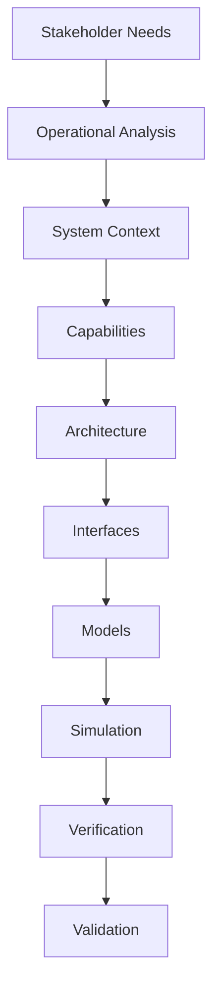
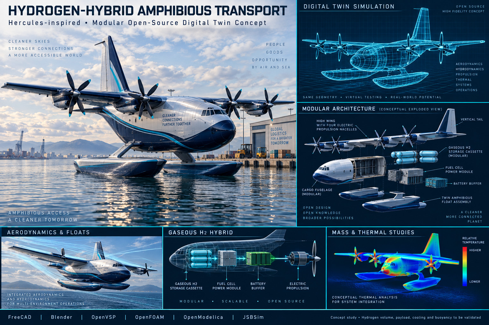
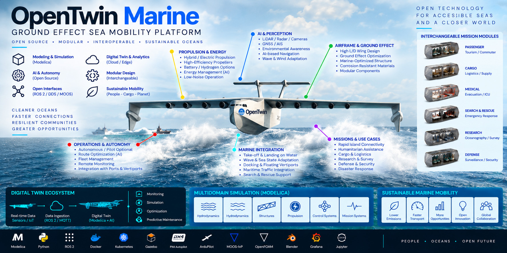
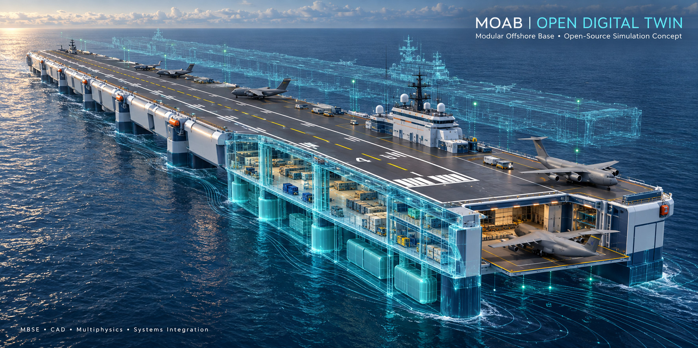
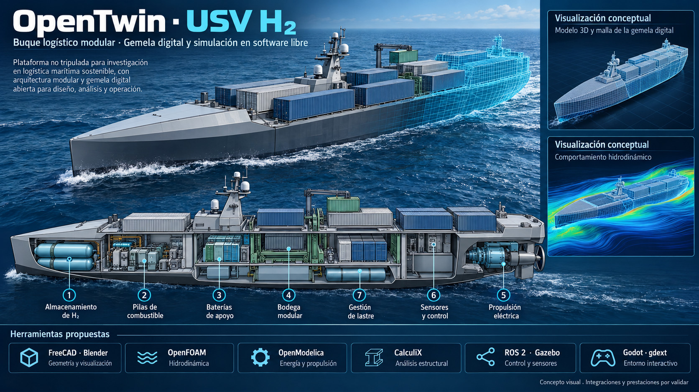
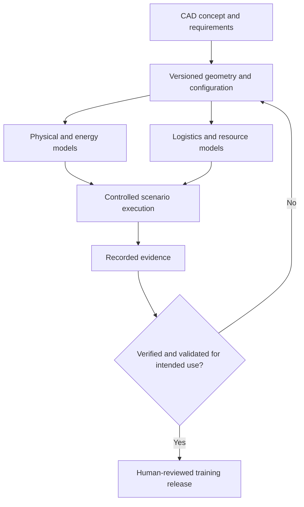

# OpenTwin MBDSS

## Open Maritime Decision Support & Simulation System

An open science platform for maritime digital engineering, digital twins,
distributed simulation and AI-assisted analysis.

**Consolidated documentation:** this English project overview and the
[Consolidated AI Integration Architecture](docs/ai-integration-architecture.md)
form the project reference. The architecture includes contracts, implementation
milestones and all seven categories of the compendium recovered from commit
`e77be5b6c73f12894b9e53e131fdb05b247bbf36`.

**Implementation status:** the capabilities below describe the reference
architecture and intended deliverables. Documentation does not establish a
working service, qualified adapter, validated model or supported hardware device.

## Contents

- [Executive Summary](#executive-summary)
- [Vision](#vision)
- [Mission](#mission)
- [Why OpenTwin MBDSS?](#why-opentwin-mbdss)
- [Strategic Objectives](#strategic-objectives)
- [Architectural Philosophy](#architectural-philosophy)
- [OpenTwin Core](#opentwin-core)
- [Model-Based Systems Engineering](#model-based-systems-engineering)
- [Maritime Digital Twins](#maritime-digital-twins)
- [CAD Design Concept Catalog](#cad-design-concept-catalog)
- [Simulation Ecosystem](#simulation-ecosystem)
- [Interoperability Architecture](#interoperability-architecture)
- [Artificial Intelligence Layer](#artificial-intelligence-layer)
- [XR and Immersive Training](#xr-and-immersive-training)
- [Mobile Offshore Base Research Environment](#mobile-offshore-base-research-environment)
- [Scientific Research Domains](#scientific-research-domains)
- [Technology Ecosystem](#technology-ecosystem)
- [Categorized Technology Compendium](#categorized-technology-compendium)
- [Expected Deliverables](#expected-deliverables)
- [Roadmap](#roadmap)
- [Open Science Commitment](#open-science-commitment)
- [Disclaimer](#disclaimer)
- [Motto](#motto)

## Executive Summary

OpenTwin MBDSS (Open Maritime Decision Support & Simulation System) is an open
engineering initiative intended to provide a reference ecosystem for maritime
digital twins, distributed simulation, decision support, immersive training,
interoperability research and applied artificial intelligence.

The project defines a modular architecture for connecting physical models,
simulators, analytical engines, AI services, multi-agent systems and visualization
tools through standardized, vendor-independent interfaces.

It aims to provide a scientific and technological experimentation platform where
researchers, universities, laboratories, innovation centers, maritime organizations
and open-source communities can develop, validate and share interoperable solutions
for complex maritime systems.

The initiative follows open science, digital engineering, Model-Based Systems
Engineering (MBSE), experimental reproducibility and human oversight to support
auditable, extensible and sustainable digital ecosystems.

## Vision

Build an open ecosystem for interoperable maritime digital twins that combines
systems engineering, physical simulation, AI, advanced analytics and immersive
training within a technically neutral and scientifically reproducible infrastructure.

Models, data and services should collaborate through open standards while keeping
individual technology choices replaceable.

## Mission

Provide an open reference architecture for representing, analyzing, simulating,
training with and evaluating complex maritime systems through:

- Digital twins and MBSE.
- Distributed simulation and multidomain physical modeling.
- Artificial intelligence and advanced analytics.
- XR environments and interoperability research.

Traceability, transparency and reproducible validation guide this work.

## Why OpenTwin MBDSS?

Maritime systems combine physical infrastructure, energy systems, logistics
networks, navigation systems, environmental factors, human operations,
heterogeneous sensors, autonomous systems and mission platforms.

These domains are often addressed with isolated tools. OpenTwin MBDSS proposes
a shared digital ecosystem in which their models and evidence can be connected
through explicit interfaces.

## Strategic Objectives

| Objective | Intended outcome |
| --- | --- |
| Engineering integration | Connect systems engineering, simulation and analytics within a common architecture |
| Digital twin standardization | Define reusable interfaces for maritime digital twins |
| Simulation federation | Coordinate simulators with different modeling approaches |
| Open interoperability | Exchange information through open standards and qualified mappings |
| Human-centered AI | Add analytical assistance while preserving human oversight |
| Scientific reproducibility | Make experiments, simulations and studies repeatable within declared tolerances |

## Architectural Philosophy

| Principle | Design implication |
| --- | --- |
| Define interfaces before implementations | Stable contracts guide component selection |
| Separate semantics from technology | Models retain meaning across technology changes |
| Simulate before deployment | Simulation provides evidence for engineering evaluation |
| Validate before trust | Results require appropriate verification and validation |
| Keep every component replaceable | Replacing a dependency should not require redesigning the platform |

## OpenTwin Core

The OpenTwin core is the proposed semantic center of the ecosystem. It maintains
canonical state, events, telemetry, system health, provenance, history,
configuration and model versions.

Digital twins interact with the core through explicit contracts rather than
direct dependencies on particular simulators or analytical engines. Each
entity/property partition has an authoritative producer; accepted state changes
and their causes are recorded.

## Model-Based Systems Engineering

OpenTwin MBDSS uses MBSE to manage complexity and connect stakeholder needs to
experimental evidence. The flow below preserves the ten stages of the project
engineering process.

```mermaid
flowchart TD
    needs["Stakeholder Needs"] --> analysis["Operational Analysis"]
    analysis --> context["System Context"]
    context --> capabilities["Capabilities"]
    capabilities --> architecture["Architecture"]
    architecture --> interfaces["Interfaces"]
    interfaces --> models["Models"]
    models --> simulation["Simulation"]
    simulation --> verification["Verification"]
    verification --> validation["Validation"]
```

The diagram shows the primary progression; engineering remains iterative.
Verification checks conformance to specified requirements. Validation evaluates
fitness for the intended use and stakeholder needs. Findings can require revision
of earlier artifacts.

Traceability links should connect requirements, architecture elements, interface
contracts, model versions, scenario configurations and verification/validation
evidence. The [AI delivery and acceptance plan](docs/ai-integration-architecture.md#delivery-and-acceptance)
applies this approach to the proposed analytical services.

## Maritime Digital Twins

| Domain | Example assets and environments |
| --- | --- |
| Surface vessels | Commercial vessels, research vessels, hydrogen-electric USVs and training platforms |
| Amphibious and ground-effect mobility | Air–sea cargo transport and coastal mobility concept studies |
| Port infrastructure | Docks, terminals, logistics centers and port equipment |
| Offshore systems | Offshore platforms, energy installations and modular infrastructure |
| Autonomous systems | Research surface vehicles and intelligent sensor networks |
| Environmental systems | Marine ecosystems, weather, currents and waves |

These are intended modeling domains; listing an asset does not establish a
validated model or operational capability.

## CAD Design Concept Catalog

The [CAD directory](MBSE/CAD/) contains four retained design illustrations.
They describe candidate maritime, amphibious and offshore research platforms.
These JPG files are concept art, not editable CAD assemblies, validated digital
twins or demonstrated operational capabilities. Captions and colored analysis
overlays do not establish measured performance.

| Concept | Design focus | Proposed OpenTwin use |
| --- | --- | --- |
| Hydrogen-hybrid amphibious transport | High-wing cargo aircraft, four electric propulsion nacelles and twin floats | Air–sea logistics, energy studies and amphibious handling scenarios |
| OpenTwin Marine ground-effect platform | Broad-wing waterborne mobility concept with interchangeable mission modules | Coastal connectivity, water operations and mission configuration studies |
| Modular Mobile Offshore Base | Connected floating modules, flight deck, hangars and logistics spaces | Infrastructure, resource coordination and emergency-response training |
| OpenTwin USV H2 | Uncrewed modular cargo vessel with hydrogen-electric power | Surface logistics, cargo handling, energy and maintenance simulation |

### Hydrogen-Hybrid Amphibious Transport

The Hercules-inspired illustration combines a modular cargo fuselage, high wing,
four electric propulsion nacelles and a twin-float assembly. Its energy concept
explicitly shows **gaseous hydrogen storage**, fuel-cell power and a buffer battery;
it must not be relabeled as liquid-hydrogen storage without a separate revision.

Proposed studies connect aerodynamics, float hydrodynamics, mass distribution,
thermal management and mission energy. Candidate scenarios include coastal cargo
transfer, island access and humanitarian logistics. Hydrogen storage volume,
usable payload, cooling, buoyancy and water-operation limits remain to be
established. The reference appearance does not imply manufacturer endorsement.

The twin should version airframe/float geometry, cargo configuration, energy
state and environmental conditions. Simulation outcomes feed logistics and
maintenance analysis through the existing evidence and instructor services.

### OpenTwin Marine Ground-Effect Platform

The asset retains its Liberty Lifter-inspired filename, while the illustration
presents an **OpenTwin Marine ground-effect sea mobility platform**. It depicts
a broad wing, distributed propulsion features, a water-compatible hull and
interchangeable passenger, cargo, medical, search-and-rescue, research and
security-observation modules.

This is a concept for studying coastal mobility and water takeoff/landing,
including interaction with docks and floating infrastructure. Compare
aerodynamic ground effect, water loads, stability, wind/wave conditions,
propulsion demand and module mass properties in explicitly defined scenarios.
Battery and hydrogen options are alternatives to evaluate, not a finalized
energy-system specification.

AI navigation, pilot-optional operation, lower noise and efficiency labels in
the artwork are research objectives. No autonomous capability, medical
certification or performance improvement is established by the image.
The project represents mission modules as configuration and training objects,
consistent with its non-operational research scope.

### Modular Mobile Offshore Base

The illustration shows a modular floating base with a continuous flight deck,
aircraft handling areas, hangars, internal storage and utility compartments.
Its “MOAB” artwork label is treated here as the modular-base concept within the
project's existing **Mobile Offshore Base (MOB)** research environment.

The proposed twin represents individual platform modules and their connections,
resource availability, deck/hangar occupancy, logistics flows, utilities and
environmental state. Research scenarios include humanitarian staging,
maintenance coordination, evacuation and disrupted resupply.

Required evidence includes platform motion, structural and connection loads,
mooring assumptions, utility continuity and aircraft-handling constraints.
The image supplies no verified runway length, aircraft capacity, sea-state
envelope or certified infrastructure design. Refer to the
[Mobile Offshore Base research environment](#mobile-offshore-base-research-environment)
for shared training authority and replay semantics.

### OpenTwin USV H2

This **uncrewed surface vessel** concept combines a container deck, cargo gantry,
internal modular hold, sensor mast and electric propulsion. The cutaway
identifies hydrogen storage, fuel cells, buffer batteries, cargo handling,
control/sensors and ballast management. The image does not specify the hydrogen
storage phase; no cryogenic architecture is inferred.

Proposed simulation cases cover loading/unloading, cargo distribution, energy
demand, propulsion availability, ballast states, sensor degradation and
supervised mission replay. Hydrodynamic overlays are conceptual visualizations,
not computed results. Capacity, endurance, stability and autonomous navigation
require independent models and validation.

### Shared Modeling and Integration Plan

The software labels in the illustrations identify proposed tool roles. They
do not establish installed dependencies, completed adapters or compatible
versions. Reuse the [technology ecosystem](#technology-ecosystem) and
[architecture contracts](docs/ai-integration-architecture.md#contracts-and-lifecycle).

| Modeling workstream | Candidate tooling shown or already considered by the project | Required artifact |
| --- | --- | --- |
| Geometry and visualization | FreeCAD, Blender; OpenVSP for the amphibious-aircraft study | Editable geometry, consistent views and asset identities |
| Energy and systems | OpenModelica | Parameterized energy/thermal models with declared assumptions |
| Fluid and structural studies | OpenFOAM, CalculiX | Versioned meshes, load cases, convergence checks and comparison evidence |
| Dynamics | JSBSim for flight studies; Project Chrono for suitable mechanical studies | Qualified configuration-specific models |
| Sensor and scenario integration | ROS 2, Gazebo and qualified adapters | Units, reference frames, clock mapping and replayable observations |
| Interactive presentation | Godot via gdext and Blender assets | Role-filtered views linked to canonical state |
| Analytics and evidence | Existing OpenTwin AI, storage and observability services | Provenance, uncertainty and human-reviewed proposals |

This allocation is a proposed modeling plan, not a claim that a generic solver
already implements each platform. Software and asset licenses must be checked
per selected revision.

```mermaid
flowchart TD
    C["CAD concept and requirements"] --> G["Versioned geometry and configuration"]
    G --> P["Physical and energy models"]
    G --> L["Logistics and resource models"]
    P --> S["Controlled scenario execution"]
    L --> S
    S --> E["Recorded evidence"]
    E --> V{"Verified and validated for intended use?"}
    V -->|No| G
    V -->|Yes| H["Human-reviewed training release"]
```

Each retained concept needs editable geometry, model boundaries, mass and
energy assumptions, interface contracts, synthetic scenarios and acceptance
criteria before it becomes a usable simulation package. Keep measured,
synthetic and AI-generated observations distinguishable. Performance and
sustainability claims require evidence beyond an illustration.

## Simulation Ecosystem

OpenTwin MBDSS treats simulation as a federation of interoperable models.

| Modeling approach | Scope |
| --- | --- |
| Continuous simulation | Equation-based hydrodynamics, energy, thermodynamics, mechanics and fluid networks |
| Discrete-event simulation | Maintenance processes, port operations, resource management and logistics |
| Multi-agent simulation | Synthetic operators, vehicles, emergency teams, logistics resources and environmental entities |
| Distributed simulation | Coordinated execution across model and service boundaries |

HLA, DEVS, FMI, DDS and ROS 2 have distinct roles. FMI supports model exchange
or co-simulation according to the selected profile; DEVS provides event-modeling
semantics; HLA supports federation services. DDS and ROS 2 support communication
and integration. Adapters must define ownership, clock mappings, units, reference
frames and event ordering.

## Interoperability Architecture

The architecture considers HLA, FMI/FMU, DDS, ROS 2, REST, OpenAPI, AsyncAPI,
MQTT, JSON Schema, Protocol Buffers, OGC interfaces, C2SIM and OARIS.

These technologies and specifications remain behind specialized adapters.
Select exact editions and supported profiles, map external schemas to canonical
twin semantics, and verify the mappings. A shared transport or acronym does not
establish interoperability or conformance.

See [architecture and ownership](docs/ai-integration-architecture.md#architecture-and-ownership)
and [contracts and lifecycle](docs/ai-integration-architecture.md#contracts-and-lifecycle).

## Artificial Intelligence Layer

The expanded design connects OpenTwin to versioned knowledge, cited
retrieval-augmented generation (RAG), local or approved remote inference,
predictive models, anomaly detection, surrogate models and bounded multi-agent
services.

Outputs are recorded as traceable proposals. The scenario service retains
authority over changes and the instructor reviews their acceptance. Contracts
cover observations, requests, results, proposals, acceptance and replay, while
keeping simulation time distinct from inference completion time.

| Capability | Intended contribution |
| --- | --- |
| Predictive maintenance | Estimate degradation and failure risk within a validated operating envelope |
| Anomaly detection | Identify unusual behavior with supporting measurements and versioned thresholds |
| Simulation optimization | Assist experiment design and computational-cost studies |
| Surrogate models | Approximate expensive simulations within declared error limits |
| Knowledge engineering | Retrieve versioned evidence and generate cited answers or abstain |
| Decision analytics | Produce explainable, evidence-linked recommendations for human review |

Read the [consolidated architecture](docs/ai-integration-architecture.md) for
model qualification, retrieval controls, agent budgets, failure handling,
deployment, observability and acceptance criteria. These remain proposed
capabilities; this documentation does not implement services or certify integrations.

## XR and Immersive Training

XR extends the proposed digital-twin environment to training, virtual inspection,
maintenance rehearsal, collaborative simulation and operational familiarization.

OpenXR, Godot, Blender and optional Monado are candidate technologies subject to
device and runtime qualification. Portable clients consume role-filtered state
and submit training interactions through the presentation gateway and instructor
service. They share asset identities, timestamps and replay records with desktop
clients.

The historical IVAS-inspired wearable concept remains a reference only; hardware,
SDK availability and device compatibility are not established.

## Mobile Offshore Base Research Environment

The project includes an experimental domain inspired by the Mobile Offshore Base
(MOB) concept. It supports research into modular floating infrastructure,
distributed logistics, maritime asset coordination, humanitarian operations,
disaster response and collaborative training.

The proposed representation uses interoperable digital twins and reproducible
synthetic scenarios. MOB training reuses the same canonical asset IDs,
instructor authority and recording services as other maritime environments.

## Scientific Research Domains

| Domain | Topics |
| --- | --- |
| Digital engineering | MBSE, digital thread and digital twins |
| Maritime engineering | Naval engineering, offshore engineering and port operations |
| Computer science | Distributed systems, middleware and interoperability |
| Artificial intelligence | Machine learning, explainable AI and multi-agent systems |
| Simulation engineering | HLA, DEVS, FMI and Modelica |
| Human factors | XR, training systems and decision support |

## Technology Ecosystem

The conceptual ecosystem includes Capella, Arcadia, OpenModelica, OpenFOAM,
Project Chrono, CalculiX, PostgreSQL/PostGIS, Grafana, Jupyter, Docker, Kubernetes,
ROS 2, DDS, Godot and Blender.

These are candidates, not automatically installed dependencies or guarantees of
compatibility. Record component revisions, licenses, asset/data rights, runtime
requirements and integration evidence before adoption.

## Categorized Technology Compendium

The complete [versioned compendium](docs/ai-integration-architecture.md#open-source-technology-compendium)
retains all seven historical categories, resource URLs, qualifications and
unresolved identity or licensing gaps.

| Category | Scope |
| --- | --- |
| 1. Synthetic training and simulation environments | Training frameworks, scenario environments and optional presentation engines |
| 2. Reactive planning and agent middleware | Planning references and asynchronous agent-service candidates |
| 3. DEVS, multimodel and continuous-system simulation | Event models, continuous systems and coupling approaches |
| 4. Information-system and exercise references | Synthetic exercise displays and information-system research |
| 5. Standards, semantic models and architecture | Architecture viewpoints, federation information models and interface specifications |
| 6. Robustness, multiscale analysis and computing performance | Offline evaluation, multiscale research and workload studies |
| 7. Maritime, MOB and portable AR baseline | Engineering, visualization, storage, XR and deployment candidates |

The [integration mapping](docs/ai-integration-architecture.md#compendium-integration-mapping)
connects each category to the AI architecture and its qualification evidence.
Historical source-review statements retain their original date and are not
represented as a new upstream audit.

## Expected Deliverables

| Deliverable | Intended content |
| --- | --- |
| OpenTwin Core | Canonical state and event infrastructure |
| Digital Twin Framework | Reusable digital-twin libraries and contracts |
| Maritime Simulation Environment | Open maritime models and simulation services |
| AI Analytics Layer | Qualified analytical and knowledge-assistance services |
| Distributed Simulation Framework | Federation and interoperability adapters |
| XR Training Environment | Immersive training clients and instructor workflows |
| Scientific Repository | Documentation, models, examples and reproducible evidence |
| CAD Concept Packages | Four retained illustrations with traceable geometry, modeling and validation roadmaps |

## Roadmap

| Phase | Focus |
| --- | --- |
| I | Architecture consolidation |
| II | OpenTwin Core |
| III | Maritime simulation |
| IV | Modelica and FMI |
| V | Distributed simulation |
| VI | Artificial intelligence and analytics |
| VII | Training, XR and lifecycle engineering |

The [delivery and acceptance plan](docs/ai-integration-architecture.md#delivery-and-acceptance)
defines proposed milestones and evidence gates. Documentation completion is
separate from implementation, integration testing and validation for a named use.

## Open Science Commitment

OpenTwin MBDSS promotes reproducible research, auditable models, complete
traceability, transparent validation, scientific collaboration and open engineering.

The initiative aims to support an international community developing technologies
for simulation, analysis and digital twins.

## Disclaimer

OpenTwin MBDSS is a research, education and engineering project. It is not an
operational command-and-control system, weapon system, navigation system,
target-selection system, autonomous decision system or replacement for qualified
operators and professionals.

All generated results require independent human validation.

## Motto

**Open Standards · Open Science · Open Simulation · Open Digital Twins**

- Model before integration.
- Simulate before deployment.
- Validate before trust.
- Keep every component replaceable.

