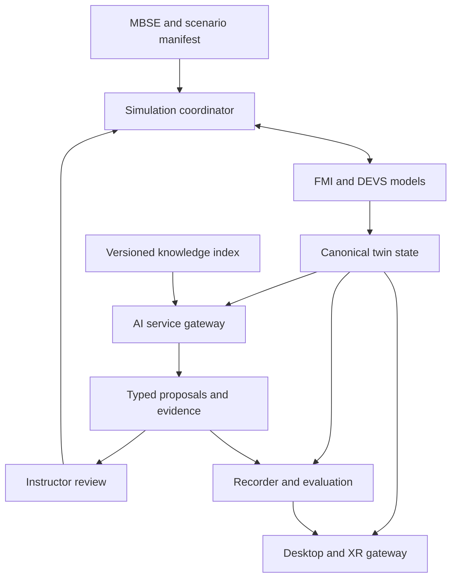

# Consolidated AI Integration Architecture

## Contents

- [Baseline and status](#baseline-and-status)
- [Architecture and ownership](#architecture-and-ownership)
- [Knowledge and RAG](#knowledge-and-rag)
- [Inference and analytical models](#inference-and-analytical-models)
- [Agent services and simulation time](#agent-services-and-simulation-time)
- [Contracts and lifecycle](#contracts-and-lifecycle)
- [Maritime, MOB and XR workflows](#maritime-mob-and-xr-workflows)
- [Compendium integration mapping](#compendium-integration-mapping)
- [Deployment and observability](#deployment-and-observability)
- [Delivery and acceptance](#delivery-and-acceptance)
- [Open-Source Technology Compendium](#open-source-technology-compendium)

## Baseline and status

This proposal merges the current OpenTwin MBDSS project vision with the
multi-model architecture and all seven compendium categories in
[commit e77be5b6c73f12894b9e53e131fdb05b247bbf36](https://github.com/robotics-intelligent-systems/jfxmbdss/commit/e77be5b6c73f12894b9e53e131fdb05b247bbf36).
It extends the AI layer for maritime engineering, maintenance, infrastructure,
synthetic logistics, humanitarian scenarios and instructor-led training.

The current main baseline is
[645284b65da0f0c3534d2da67e2555ec3013b0d7](https://github.com/robotics-intelligent-systems/jfxmbdss/commit/645284b65da0f0c3534d2da67e2555ec3013b0d7).
Current project scope and asset removals take precedence over historical material.
Only the relevant architecture and catalog are carried forward.

**Status: documentation and proposed interfaces.** This change implements no
inference server, model, agent, simulator adapter or hardware connection.
References to an existing boundary describe the architectural baseline, not
evidence of executable services. The historical catalog retains its original
review date and qualifications; upstream projects have not been re-audited here.

## Architecture and ownership

AI is a replaceable advisory service around the canonical twin and simulation
coordinator. It reads versioned evidence and proposes results. The scenario
service accepts changes; the twin core owns accepted state.

| Plane | Responsibility | Owner and boundary |
| --- | --- | --- |
| Engineering | Requirements, use cases, assumptions and validation criteria | MBSE registry; versioned scenario manifest |
| Knowledge | Documents, structured asset records, provenance and retrieval | Knowledge service; role-filtered evidence API |
| AI | Retrieval synthesis, prediction, anomaly scores and surrogate inference | AI gateway; typed requests and bounded model workers |
| Agents | Bounded tasks, decomposition and cooperative synthetic workflows | Task coordinator; no direct authoritative twin writes |
| Simulation | Continuous/discrete model coupling and scenario lifecycle | One logical clock authority per run |
| Twin | Stable asset IDs, accepted state, health and events | One authoritative producer per entity/property partition |
| Federation | Selected external schemas and exchange profiles | Qualified adapters; explicit ownership and time mappings |
| Presentation | Scenes, GIS, checklists and reviewed assistance | Desktop/XR gateway; shared session and asset identifiers |
| Evidence | Inputs, outputs, approvals, versions, metrics and replay | Append-only run records with access-controlled retention |

FMI connects selected physical models; DEVS provides discrete-event semantics.
HLA federation time management must map explicitly to the coordinator's clock.
DDS, ROS 2 and message brokers transport data but do not establish shared time.
NETN FOM supplies federation information models, not an RTI. C2SIM and OARIS
remain separately qualified research mappings.

## Knowledge and RAG

1. Ingest approved technical manuals, requirements, model documentation and
   synthetic experiment reports. Capture source URI, revision, checksum,
   owner, access scope and permitted use.
2. Extract text and tables, preserve page/section offsets and units, and
   quarantine failed extraction. Link asset identifiers to the canonical
   registry without merging uncertain entity matches automatically.
3. Build lexical and vector indexes over versioned chunks. Store embedding
   model revision, chunking configuration and index snapshot ID.
4. Apply authorization filters before retrieval and again before returning
   evidence. Rank relevant chunks and include source locations in the response.
5. Produce a cited answer or explicitly abstain when evidence is missing,
   contradictory, obsolete or outside the selected asset/model version.

Retrieved documents are data, not tool instructions. The gateway must keep
document text separate from policy and tool definitions, restrict available
tools by role, and reject attempts to change permissions through retrieved
content. Removing a document must invalidate affected indexes and caches.

A relational asset/document registry and a replaceable retrieval index keep
knowledge semantics independent of a particular database or embedding vendor.
Structured telemetry is queried by asset, time window and units; it is not
silently converted into unsupported narrative evidence. RAG citations are
traceability aids, not validation of the underlying engineering model.

## Inference and analytical models

| Capability | Inputs | Output and validation boundary |
| --- | --- | --- |
| Knowledge assistant | Approved chunks and selected twin snapshot | Cited explanation, limitations and abstention |
| Predictive maintenance | Quality-checked history and maintenance labels | Horizon-specific estimate, uncertainty and calibration evidence |
| Anomaly detection | Time-aligned signals and operating context | Score, threshold version and supporting measurements |
| Surrogate simulation | Inputs inside a declared parameter envelope | Approximation with error bounds against the reference model |
| Experiment assistance | Scenario manifests and completed run metrics | Proposed parameter study for human review |
| Training feedback | Recorded checklist events and instructor rubric | Evidence-linked draft assessment for instructor acceptance |

Provide an inference-provider interface so local/on-premise workers and an
optional approved remote provider can be substituted without changing twin
schemas. Pin model artifact or provider model identifier, tokenizer where
applicable, prompt template, inference configuration and output schema.
Local model selection remains a qualification decision, not a dependency
introduced by this document.

Use request deadlines, cancellation, concurrency limits and bounded retries.
Never retry a state-changing operation without an idempotency key. A provider
failure produces an unavailable/abstained result; it does not silently route
restricted data to another provider. Remote routing requires an explicit
deployment policy permitting the particular data class and destination.

Numerical models need time/asset-separated evaluation datasets to avoid leakage.
Record baseline performance, missing-data behavior and operating envelope.
Out-of-envelope surrogate requests return to the reference simulation when
available; otherwise report unsupported inputs. A language model does not
replace the physical solver or certify its results.

## Agent services and simulation time

Use bounded agents for evidence retrieval, experiment preparation, maintenance
analysis and report drafting. OpenMAS is a cataloged candidate for asynchronous
services, while reactive-planning and multi-agent environments remain qualified
research alternatives. Agent roles share versioned observations, not implicit
mutable memory.

A proposed task lifecycle is: queued, running, proposed, reviewed, accepted or
rejected; tasks may also terminate as cancelled, expired or failed. Limit
iterations, tool calls, elapsed time and resource use. Propagate cancellation
to child tasks and record partial results as incomplete.

The coordinator assigns observations a simulation timestamp and acceptance
window. Wall-clock completion never advances simulation time. Late results
are rejected or deferred according to the scenario manifest. For equal-time
events use a declared stable ordering key. Persist accepted outputs for replay
instead of assuming repeated model inference is deterministic.

An instructor-approved proposal becomes a validated scenario-service request.
That service checks role, schema, asset revision, preconditions and idempotency
before scheduling a change. Stale proposals must be recalculated or rejected.
Agents cannot write directly to a federation, headset control path or twin store.

For FMI/DEVS coupling, declare step size or negotiation policy, unit/frame
conversion, event ordering, numerical tolerances and algebraic-loop handling.
If a backend cannot checkpoint or roll back, record that limitation and choose
a compatible conservative execution policy.

## Contracts and lifecycle

These are proposed contract requirements, not implemented endpoints.

| Contract | Required fields and behavior |
| --- | --- |
| Model manifest | Component ID, upstream/revision, runtime, license evidence, interface/profile versions, fidelity and validation envelope |
| Scenario manifest | Scenario/revision, assets, dataset snapshot, model set, clock policy, seeds, thresholds and instructor role |
| Observation | Run ID, entity ID, state revision, simulation time, wall-clock capture time, units/frame, validity and synthetic-data flag |
| AI request | Request/task ID, principal/scope, evidence snapshot, capability, deadline, model policy and output schema |
| AI result | Request ID, model/config revision, evidence references, typed result, uncertainty method if applicable, limitations and status |
| Proposal | Proposal ID, expected state revision, permitted action, preconditions, expiry and supporting result IDs |
| Acceptance record | Proposal ID, reviewer, decision, reason, accepted simulation time and resulting event ID |
| Event | Event ID, run/source, schema version, simulation time, causal reference, sequence and acknowledgment policy |
| Replay bundle | Manifests, input snapshots, accepted outputs, event stream, runtime versions, seeds and declared tolerance |

Distinguish measured uncertainty, calibrated probability and uncalibrated
model scores; do not present a generated confidence number as statistical evidence.
Keep unavailable values explicit rather than substituting zero.

Services expose readiness, health and capability descriptions. Simulation
lifecycle covers initialize, configure, ready, run, pause, checkpoint where
supported, reset and stop. Reset creates a new run identity or epoch so delayed
messages cannot contaminate a new run. Deduplicate event IDs and prevent
adapter feedback loops. Version incompatible schemas explicitly.

## Maritime, MOB and XR workflows

| Workflow | Integrated path | Human-reviewed result |
| --- | --- | --- |
| Vessel maintenance study | Synthetic sensor history → anomaly/prediction worker → cited maintenance evidence | Prioritized inspection suggestions |
| MOB logistics exercise | DEVS queues and resource model → cooperative agent proposal → instructor → scenario service | Accepted resource schedule with replay |
| Offshore infrastructure study | Modelica/FMI reference model → bounded surrogate comparison → metrics | Engineering comparison with fidelity limits |
| Portable AR training | Twin snapshot → role-filtered gateway → checklist interaction → recorded assessment | Instructor-approved assistance and feedback |
| Humanitarian exercise review | Recorded synthetic events → evidence retrieval → report draft | Traceable after-action report |

MOB modules, vessels, infrastructure and training assets use the same IDs across
simulation, analytics and desktop/AR views. Portable clients receive filtered
presentation state with timestamps and stale-data indicators. Tracking loss,
disconnect or inference timeout must not invent fresh state. Reconnection
requires a new authorized snapshot and event cursor.

Preserve the historical IVAS-inspired concept as a reference only; no hardware,
SDK access or device compatibility is established. OpenXR/Monado/Godot remain
device-qualified candidates. Training interactions go through the instructor
service rather than becoming external command channels.

## Compendium integration mapping

The full historical resource list follows below. This table connects every
category to the expanded AI design without making the catalog a dependency lockfile.

| Category | AI integration point | Required evidence before adoption |
| --- | --- | --- |
| 1. Synthetic training and simulation environments | Recorded synthetic observations and training presentation | Model fidelity, asset rights and non-operational scenario qualification |
| 2. Reactive planning and agent middleware | Typed tasks, bounded tools and proposal lifecycle | Runtime compatibility, cancellation and simulation-time adapter tests |
| 3. DEVS, multimodel and continuous-system simulation | Reference-model inputs and surrogate evaluation | Solver/event coupling, numerical comparison and repeatable reset |
| 4. Information-system and exercise references | Optional synthetic map and exercise views | Identity, interfaces, permitted use and provenance-preserving mappings |
| 5. Standards, semantic models and architecture | Asset semantics, MBSE traceability and federation gateways | Selected editions, schema mapping and profile-specific conformance evidence |
| 6. Robustness, multiscale analysis and computing performance | Offline model, workload and robustness evaluation | Reproducible datasets, baselines and declared measurement limits |
| 7. Maritime, MOB and portable AR baseline | Persistent twin state, telemetry and training clients | Shared IDs, access filtering, stale-data and replay checks |

Retain unresolved RIPR, Extensible BML and CMD identities as gaps. Retain AFSIM
access/distribution and ModelicaDEVS licensing qualifications. Cataloged source
availability is not evidence of an openly licensed runtime, compatibility or
a working adapter. New AI services progress separately through cataloged,
implemented, integration-tested and validated-for-a-named-use states.

## Deployment and observability

Start with one on-premise synthetic scenario, one retrieval service, one model
worker and one recorder. Container packaging is optional; Kubernetes is a later
scaling choice. Keep simulation coordination independent of AI worker availability.
An unavailable AI service must leave manual training and recorded replay usable.

Separate ingestion, inference, simulation and presentation service identities.
Apply least-privilege access to documents and run data. Keep secrets outside
manifests and logs. Store approved model artifacts, dependency manifests,
checksums and license evidence for disconnected deployments.

Measure request latency, queue depth, timeouts, retrieval coverage, citation
coverage, abstention, invalid proposals, stale observations, model drift and
replay divergence. Correlate traces through run, request, task and event IDs.
Monitor without copying unrestricted document text or credentials into logs.
Retain a last approved model/index pair for rollback and record the rollback event.

## Delivery and acceptance

All implementation milestones below remain pending. Numerical thresholds must
be set in a named scenario before its evaluation; this proposal claims no measured
performance or validated maritime behavior.

| Stage | Deliverable | Acceptance evidence |
| --- | --- | --- |
| 1. Contracts and baseline | Synthetic MOB maintenance scenario; manifests and canonical schemas | Unit/frame checks, schema rejection, ownership checks and reproducible reset |
| 2. Recorder and retrieval | Versioned evidence corpus, index and run records | Source-offset correctness, revoked-document exclusion, access filtering and no-evidence abstention |
| 3. AI gateway | One qualified local inference or analytics worker | Deadline/cancellation behavior, schema validation, offline operation and unavailable-service fallback |
| 4. Analytical evaluation | One anomaly or surrogate model with baseline | Held-out asset/time evaluation, declared error/calibration limits and out-of-envelope rejection |
| 5. Bounded agents | One cooperative logistics/maintenance task | Budget enforcement, stale-result rejection, instructor acceptance and idempotent scheduling |
| 6. Multimodel federation | One DEVS/FMI coupling and selected exchange profile | Event ordering, duplicate suppression, late messages, recovery and replay tolerance |
| 7. Desktop and AR | Shared gateway and recorded training session | Role filtering, tracking loss, reconnect, stale-data display and instructor-reviewed assessment |

Trace each requirement to a scenario, contract, implementation version and
evidence artifact. Separate documented design completion from executed tests.
Before promoting a candidate, resolve its identity, rights, runtime and supported
profile; record remaining limitations in the component manifest.

## Open-Source Technology Compendium

The following catalog separates software candidates, standards, restricted
or proprietary-runtime references, and unresolved project identities.
Source review: 2026-09-20. All new jfxmbdss adapters remain **proposed**.

### 1. Synthetic training and simulation environments

| Resource | Catalog role | Qualification |
| --- | --- | --- |
| [The Shoot: Open Fire Framework — ShootOFF](https://github.com/phrack/ShootOFF) | Laser dry-fire training framework reference | Distinct from the retired Python legacy version; reference only, not a maritime or IVAS integration |
| [Half-Life engine based games / Half-Life SDK](https://github.com/ValveSoftware/halflife) | Game interaction and scenario-authoring reference | Valve SDK has specific distribution restrictions; game assets and runtime rights are separate from source availability |
| [Delta3D](https://github.com/delta3d/delta3d) | Optional simulation/3D presentation engine candidate | Qualify source build, dependencies, asset licenses and adapter compatibility |
| Advanced Framework for Simulation, Integration, and Modeling (AFSIM) | Comparative simulation-framework reference | Distribution/access conditions and authoritative version are unresolved here; not classified as an unrestricted open-source dependency |
| [ARL Battlespace](https://github.com/USArmyResearchLab/ARL_Battlespace) | Abstract adversarial-reasoning research environment | Reviewed implementation is a Python strategy game; not evidence of a high-fidelity operational MDO system |
| [Multi-Agent Simulation Platform](https://github.com/sdk2035/multi-agent-sim) | Emergent-behavior research reference | Reviewed fork includes resource-sharing and cooperative-task environments; preserve upstream provenance and evaluate toy-model limitations |

These entries identify research resources. Tactical policy development,
weapon control and operational deployment are outside the existing project
boundary. Initial integration experiments use synthetic cooperative workflows.

### 2. Reactive planning and agent middleware

| Resource | Proposed role | Qualification |
| --- | --- | --- |
| [Reactive plan execution in multi-agent environments](https://github.com/cguz/planning-reactive-planner) | Reactive-planning research reference | README identifies the included Reactive Planner as single-agent code within broader dissertation research; do not assume a complete distributed platform |
| Reactive Integrated Planning Architecture (RIPR) | Requested planning-architecture reference | Exact authoritative source/version unresolved; similarly named repositories were not treated as matches |
| [RoboRTS](https://github.com/RoboMaster/RoboRTS) | Mobile-robot and real-time-strategy software reference | Hardware/ROS-specific stack; reviewed README marks part of the intelligent multi-agent layer as TODO |
| [OpenMAS](https://github.com/openmas-ai/openmas) | Asynchronous Python agent-service candidate | Lifecycle and pluggable communications; requires a separate simulation-time adapter |
| [OpenMAS for MATLAB](https://github.com/douthwja01/OpenMAS) | Naming-disambiguation reference | Different project with a proprietary MATLAB runtime dependency; not the requested asynchronous Python framework |

Use agent components behind typed task and observation interfaces. Log the
model/policy version and any instructor-accepted output; do not equate
asynchronous completion order with deterministic simulation behavior.

### 3. DEVS, multimodel and continuous-system simulation

| Resource | Proposed role | Qualification |
| --- | --- | --- |
| [VLE — Virtual Laboratory Environment](https://github.com/vle-forge/vle) | DEVS-based multimodel simulation candidate | Qualify model packages, build dependencies and clock ownership |
| [PythonPDEVS](https://github.com/capocchi/PythonPDEVS) | Parallel DEVS implementation candidate | Reviewed repository provides minimal/local and distributed configurations with different capabilities; pin the selected implementation |
| [ModelicaDEVS](https://github.com/modelica-3rdparty/ModelicaDEVS) | Modelica discrete-event library reference | README explicitly states unclear licensing; reference-only until rights and toolchain compatibility are resolved |
| [DEVS Streaming Framework](https://github.com/simlytics-cloud/devs-streaming) | Requested protocol for composing distributed DEVS models across frameworks | JSON exchange specification; each framework needs an execution wrapper and scheduling semantics, not just a streaming connection |
| C Model Developer (CMD) | Requested C-based, time-dependent ODE modeling environment reference | Exact upstream unresolved; a similarly named custom C++ repository was not assumed to be this tool |
| Modelica / OpenModelica / FMI | Existing continuous subsystem modeling and model-exchange boundary | Select FMI mode/version and establish event/solver coupling explicitly |

### 4. Information-system and exercise references

| Resource | Catalog role | Qualification |
| --- | --- | --- |
| [Real-Time Battle Field Management System](https://github.com/bluebat/rtbfms) | Requested information-system reference | Reviewed README provides only the project name; functionality, interfaces and license need further evidence |
| [ODINv2 — Open Source C2IS](https://github.com/syncpoint/ODINv2) | Optional map/collaboration reference for synthetic exercise displays | Not a physics engine; verify licensing, exchange formats and selected release before any adapter |
| [Boomslang](https://github.com/kabartsjc/boomslang-c2-sim) | C2 doctrine/exercise simulation research reference | Upstream describes simplified modeling; does not establish operational validity or jfxmbdss interoperability |
| Extensible Battle Management Language | Requested language/schema reference | Exact specification and implementation unresolved; do not silently substitute another BML dialect or the unrelated multimedia EBML format |

These remain isolated research references. A future synthetic-data display
adapter must preserve source IDs, timestamps and provenance without enabling
real operational command functions.

### 5. Standards, semantic models and architecture

| Resource | Architectural use | Qualification |
| --- | --- | --- |
| [UDDL query-language implementation](https://github.com/Epistimis/UDDL-Query-Language) | Data-definition/query semantics reference originating in FACE work | Reviewed implementation is unofficial and reports incomplete constraint support; distinguish it from the underlying specification |
| [NATO Education and Training Network (NETN) FOM](https://github.com/AMSP-04/NETN-FOM) | Candidate HLA information model for distributed training | Reviewed artifact license is CC BY-ND 4.0; preserve upstream modules and review terms before modifying or redistributing derived artifacts |
| [OARIS — Open Architecture Radar Interface Standard](https://www.omg.org/spec/OARIS/) | Versioned external sensor/environment interface research | An interface specification, not a complete simulator; choose the exact edition and a non-operational subset |
| [UAF — Unified Architecture Framework](https://www.omg.org/spec/UAF/) | Requirements and architecture viewpoints | Correct name is Unified, not United; modeling framework rather than runtime middleware |
| [C2SIM — Command and Control Simulation Interoperation](https://github.com/OpenC2SIM/C2SIMArtifacts) | Simulation-interoperation schema/artifact reference | Pin SISO specification/artifact versions and test mappings; repository inclusion does not imply conformance |
| HLA / DDS / ROS 2 / OpenAPI / AsyncAPI | Existing federation, messaging and service boundaries | Distinct responsibilities; document schemas, ownership, QoS and time semantics |

### 6. Robustness, multiscale analysis and computing performance

| Resource | Proposed role | Qualification |
| --- | --- | --- |
| [Adversarial Machine Learning Library — adlib](https://github.com/vu-aml/adlib) | Offline robustness evaluation on approved synthetic datasets | MIT-licensed research library with legacy dependencies; not a maritime simulator or operational decision service |
| [ARL Hierarchical MultiScale Framework (ARL-HMS)](https://github.com/USArmyResearchLab/ARL-Hierarchical-Multiscale-Framework) | Optional heterogeneous-HPC multiscale model evaluation | C++/Python framework; each component model and scale bridge needs its own verification |
| [The Sniper Multi-Core Simulator](https://github.com/snipersim/snipersim) | Optional processor/workload performance research | x86 multicore architectural simulator, not a marksmanship or battlefield simulator; inspect NOTICE and dependencies |
| PyTorch / TensorFlow / MLflow / Jupyter | Existing analytics, experiments and reports | Dataset lineage, evaluation split and model-version tracking |

### 7. Preserved maritime, MOB and portable AR baseline

| Domain | Existing candidates | Role |
| --- | --- | --- |
| MBSE | Capella / Arcadia | Architecture and requirement-to-test traceability |
| Physical simulation | OpenFOAM, Project Chrono, CalculiX | Hydrodynamics, mechanics and structural research |
| Geometry and views | Blender, Godot, QGIS | Original assets, 3D clients and geospatial analysis |
| Storage and monitoring | PostgreSQL/PostGIS, Grafana | Twin records, spatial data and observations |
| Portable XR | OpenXR, optional Monado | Device-qualified rendering/runtime boundary |
| Wearable concept | IVAS | Reference only; actual device compatibility remains unknown |
| Deployment | Docker, Kubernetes | Optional reproducible packaging and service hosting |

### Admission and evidence

For every component record upstream URL, fork relationship, revision,
license, data/asset rights, runtime, supported profiles, adapter version,
fidelity and test evidence. Track **cataloged**, **implemented**,
**integration-tested**, and **validated for a named use** separately.

RIPR, Extensible Battle Management Language and CMD remain explicit identity
gaps. AFSIM remains an access/distribution qualification gap. ModelicaDEVS
remains a licensing gap. None is a mandatory dependency. Public source,
a standard, a hardware platform and an openly licensed runtime are different
categories and must not be described as one uniformly libre stack.

